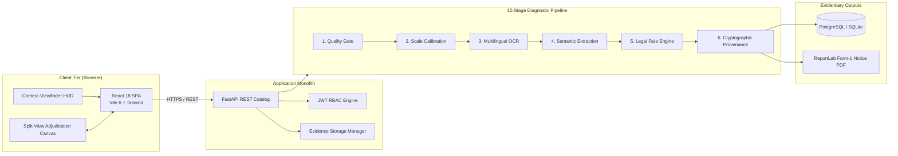

<p align="center">
  <a href="https://www.sih.gov.in/"></a>&nbsp;
  <a href="https://consumeraffairs.nic.in/"></a>&nbsp;
  <a href="https://sih26034.vercel.app/"></a>&nbsp;
  <a href="http://68.233.117.16:8000/api/v1/health"></a>&nbsp;
  &nbsp;
  <a href="LICENSE"></a>
</p>

<p align="center">
  <picture>
    <source media="(prefers-color-scheme: dark)" srcset="assets/brand/svg/nirikshak-banner-hero-dark.svg">
    
  </picture>
</p>

<h3 align="center">AI-Assisted Legal Metrology Inspection & Evidence Workstation</h3>
<p align="center"><em>Statutory Compliance Verification & Evidentiary Dossier Generation for the Department of Consumer Affairs (DoCA)</em></p>

<p align="center">
  <a href="https://sih26034.vercel.app/"><strong>🌐 Open Live Workstation</strong></a> &nbsp;&nbsp;•&nbsp;&nbsp;
  <a href="https://sih26034.vercel.app/api/v1/health"><strong>⚡ Backend Health Check</strong></a> &nbsp;&nbsp;•&nbsp;&nbsp;
  <a href="#-live-production-deployment-architecture"><strong>🏗️ Cloud Architecture</strong></a>
</p>

<p align="center">
  <strong>📸 75 Packaging Photos</strong> &nbsp;&nbsp;•&nbsp;&nbsp;
  <strong>📦 7 Golden Demo SKUs</strong> &nbsp;&nbsp;•&nbsp;&nbsp;
  <strong>💻 Offline Field Mode</strong>
  <br/>
  <strong>Evidence-Linked Traceability</strong> &nbsp;•&nbsp;
  <strong>Human-Reviewed Adjudication</strong> &nbsp;•&nbsp;
  <strong>Section 63 BSA Support</strong>
</p>

<p align="center">
  <a href="https://www.python.org/"></a>&nbsp;
  <a href="https://fastapi.tiangolo.com/"></a>&nbsp;
  <a href="https://reactjs.org/"></a>&nbsp;
  <a href="https://onnxruntime.ai/"></a>
</p>

---

## Overview

**Nirikshak is a digital inspection workstation for Legal Metrology officers.**

It turns fragmented packaging inspection into one traceable workflow: **capture evidence, measure, extract declarations, check rules, review findings, and generate the inspection dossier.**

### The Core Differentiator
> **Evidence-linked inspection with automated analysis, physical measurement, deterministic statutory checks, and mandatory officer adjudication in one workflow.**

Every finding remains traceable to the evidence that produced it:

<p align="center">
  
</p>

Nirikshak incorporates workflow safeguards that keep automated analysis subordinate to authorized officer review. The system serves strictly as an **Augmented Diagnostic Assistant**—it never issues compounding orders, penalty notices, or citations autonomously. Every statutory adjudication remains under the explicit control of a qualified Legal Metrology Officer (LMO).

---

## Problem & Solution

### The Problem (SIH26034)
Enforcement officers inspecting packaged commodities in wholesale mandis, retail outlets, and e-commerce fulfillment hubs face persistent operational hurdles:
1. **Scattered Evidence & Broken Traceability:** Officers capture loose photos on personal phones, take manual notes in paper registers, and calculate metrics by hand—creating fractured chains of custody vulnerable to evidentiary challenge.
2. **Cognitive Load Across Multilingual Packaging:** Transcribing mandatory statutory declarations (MRP, Net Quantity, Unit Sale Price, Manufacturing Date, Consumer Care, Country of Origin) across English and regional Indic scripts is labor-intensive and prone to error.
3. **Complex Metric Font Verification:** Verifying minimum numeral font heights across packaging surface areas under the Legal Metrology (Packaged Commodities) Rules, 2011 (varying from $1.0\text{ mm}$ to $6.0\text{ mm}$) requires physical calipers and manual geometric calculations that are difficult to standardize in field conditions.
4. **Black-Box Automation Pitfalls:** Automated scanners often output opaque, unverifiable verdicts without showing underlying coordinate evidence or permitting human correction, failing administrative standards.

### The Solution: Nirikshak
Nirikshak unifies field intake, calibrated computer vision, multilingual scene text recognition, deterministic statutory logic, and human adjudication into a single web platform:

<p align="center">
  
</p>

---

## Flagship Inspector Workflow

The complete inspection flow:

<p align="center">
  
</p>

> **The key idea:** Every automated finding remains linked to the evidence that produced it, and the authorized officer makes the final disposition.

*For complete pipeline stage specifications, sequence diagrams, and mathematical formulations, see [docs/specifications/03_FINAL_ARCHITECTURE.md](docs/specifications/03_FINAL_ARCHITECTURE.md).*

---

## Human-in-the-Loop Adjudication

Nirikshak places the human officer at the center of all enforcement decisions:

<p align="center">
  
</p>

- **AI findings stay diagnostic:** automated analysis never becomes the final legal disposition.
- **Every finding is inspectable:** officers can trace it to the source evidence, extracted field and governing rule.
- **Overrides are accountable:** changes require written justification and remain in the audit trail.

Administrative authority is strictly separated via role-based access control (RBAC): field inspectors propose preliminary recommendations, while authorized Controllers review and sign formal statutory notices.

---

## Key Capabilities

### 1. Evidence Intake & Optical Quality Gate
- **Guided Viewfinder HUD:** Real-time optical assistance prompts field officers for camera stabilization, framing distance, and glare control.
- **Degradation Screening:** Automatically detects excessive blur and specular glare, routing unreadable inputs to guided recapture.
- **Multi-Source Ingestion:** Supports live camera captures, high-resolution multi-facet photos, and Rule 6(10) e-commerce URLs.

### 2. Physical Measurement & Metric Calibration
- **Scale Calibration:** Computes physical millimeter scale from standard ISO-7810 debit/credit cards ($85.60\text{ mm} \times 53.98\text{ mm}$) or ArUco markers ($50.0\text{ mm}$) on standard smartphone/camera hardware.
- **PDP Surface Area:** Determines physical packaging face area across rectangular, cylindrical, and flexible packages.
- **Numeral Font Measurement:** Measures physical millimeter numeral height to verify compliance against statutory minimums.

### 3. Multilingual Declaration Extraction & Vision Probing
- **Bilingual Scene Text:** Transcribes packaging declarations across English and Devanagari Hindi text.
- **180° Inversion Auto-Detection:** Automatically probes inverted 180° orientation on low-confidence crops ($p_{\text{conf}} < 0.92$), transcribing upside-down physical packaging labels with $> 0.98$ confidence.
- **Multi-Facet Cross-Panel Fusion:** Fuses declarations across multiple package panels (`FRONT_PDP`, `SIDE_PANEL`, `MACRO_CLOSE_UP`, `STAMP`, `BOTTOM_BASE`, `BACK_PANEL`) into a unified statutory record.
- **Statutory Entity Parsing:** Extracts mandatory declarations: MRP, Net Quantity, Unit Sale Price, Dates, Consumer Care, and Origin.
- **Prohibited Unit Detection:** Flags non-standard metric abbreviations (`gms`, `gm`, `ML`, `ltrs`) prohibited under Section 11.

### 4. Deterministic Compliance Analysis
- **Table-I Font Schedules:** Verifies numeral height against surface-area statutory schedules without probabilistic drift.
- **USP Arithmetic Consistency:** Checks Unit Sale Price calculations against declared MRP and Net Quantity.
- **Statutory Rules & Epochs:** Evaluates declarations against packaging date amendments and Rule 6(10) digital marketplace exemptions.

### 5. Evidence-Linked Officer Adjudication
- **Interactive Split Canvas:** Side-by-side packaging photo inspection with vector bounding polygons and statutory findings.
- **Audit-Logged Overrides:** Requires mandatory written justification remarks whenever an officer overrides a recommendation.
- **Case State Lifecycle:** Enforces structured case progression from initial registration to final administrative disposition.

### 6. Cryptographic Evidence Trail & Cloud Datastore
- **Section 63 BSA Support:** Generates evidentiary metadata and audit logs supporting Section 63 BSA 2023 digital evidence workflows.
- **Merkle Chain of Custody:** Anchors source images, extracted tokens, and officer decisions in a tamper-evident SHA-256 hash tree.
- **Supabase Cloud Storage & PostgreSQL:** Provides persistent cloud object storage (`evidence-images` bucket) and PostgreSQL 16 datastore with complete cryptographic disposal linking.
- **Form-1 Statutory Notice PDF:** Compiles formal inspection memos with evidence crops, cryptographic digests, and signature blocks.

### 7. Offline Field Resilience (Mode B)
- **Local Standalone Runner:** Enables field officers to conduct inspections on standalone laptops (`localhost:8000`) with local SQLite.
- **Cryptographic Sync Bundles:** Packages offline inspection cases and evidence into signed bundles for central reconciliation.

---

## 4-State Uncertainty-Aware Verdict Model

Nirikshak classifies evaluated checks into four clear operational states:

```text
┌───────────────────┬────────────────────────────────────────────────────────────────────────┐
│ Verdict State     │ Operational Definition & System Action                                 │
├───────────────────┼────────────────────────────────────────────────────────────────────────┤
│ PASS              │ No configured statutory discrepancy detected across the evaluated      │
│                   │ declarations and measurements.                                         │
├───────────────────┼────────────────────────────────────────────────────────────────────────┤
│ FAIL              │ Rule-engine discrepancy detected based on available evidence (e.g.,    │
│                   │ font deficit, prohibited unit 'gms', or USP math mismatch > 0.02 INR). │
├───────────────────┼────────────────────────────────────────────────────────────────────────┤
│ REVIEW            │ Borderline measurement falling within the sensor uncertainty band      │
│                   │ (k=2, 95% confidence). Officer must conduct physical verification.     │
├───────────────────┼────────────────────────────────────────────────────────────────────────┤
│ UNABLE_TO_VERIFY  │ Optical quality degraded (excessive blur, glare bloom, or occlusion).  │
│                   │ Directs officer to guided recapture flow before processing.            │
└───────────────────┴────────────────────────────────────────────────────────────────────────┘
```

---

## Real-World Validation & Proof

Nirikshak is backed by empirical testing on real retail commodities and automated verification:

<p align="center">
  
</p>

### Golden Demonstration SKUs
Thirteen representative reference commodities (7 statutory edge cases + 6 certified real physical packaging cases) are packaged directly into the workspace and catalog for instant demonstration:

| SKU / ID | Scenario | Result | Key Diagnostic Observation & Legal Basis |
|:---|:---|:---:|:---|
| **DEMO-01** | Sunfeast Butter Cookies 200g | `FAIL` | Table-I font deficit ($2.8\text{ mm} < 4.0\text{ mm}$); prohibited unit `gms` |
| **DEMO-02** | Everest Garam Masala 100g | `FAIL` | USP mismatch ($\text{Rs } 0.45/\text{g}$ declared vs $\text{Rs } 0.52/\text{g}$ computed) |
| **DEMO-03** | Himalayan Mineral Water 1L | `PASS` | Compliant baseline (numeral font $4.2\text{ mm}$, valid unit `L`, correct USP) |
| **DEMO-04** | Medimix Ayurvedic Soap 75g | `REVIEW` | Sensor uncertainty ($2.48\text{ mm}$ observed within $\pm 0.05\text{ mm}$ threshold band) |
| **DEMO-05** | Kurkure Masala Munch 90g | `UNABLE_TO_VERIFY` | Specular glare bloom obscuring net quantity panel; routes to recapture |
| **DEMO-06** | Royal Delight Almonds 500g | `FAIL` | E-Commerce: missing Country of Origin declaration; exempts Mfg Date |
| **DEMO-07** | Fortune Sunlite Oil 1L | `FAIL` | Indic Hindi Devanagari Net Qty numeral font deficit ($2.9\text{ mm} < 4.0\text{ mm}$) |
| **REAL-PKG-WATCH** | Fastrack Wristwatch (`Item 1`) | `PASS` | Single unit count (`01 NUMBER` $\rightarrow$ `1 N`) exempt from USP under Rule 6(1)(da) Second Proviso; 180° inverted label auto-rectified |
| **REAL-PKG-BRAHMI** | Himalaya Brahmi 60T (`Item 2`) | `PASS` | Tri-panel fusion: Front PDP, Side LM panel with rate `Rs. 4.33/TAB.`, Back panel registered office Bangalore `560058` |
| **REAL-PKG-FACEWASH** | Dot & Key Face Wash 100ml (`Item 3`) | `PASS` | Dual corporate entity decoupling (Mfg Solan HP vs Mkt Kolkata WB); volume rate `₹2.49/ml` verified |
| **REAL-PKG-PERFUME** | Bella Vita Perfume 20ml (`Item 4`) | `PASS` | Base panel batch stamp fusion; volume rate `₹19.95/ml`; Gurugram Haryana manufacturing entity |
| **REAL-PKG-NAMKEEN** | Haldiram's Namkeen 400g (`Item 5`) | `PASS` | Clean SI unit symbol `400 g` (0 prohibited `gms` flags); mass rate `Rs. 0.25/g` verified |
| **REAL-PKG-CHIA** | True Elements Chia 250g (`Item 6`) | `PASS` | Nutritional declaration isolation; rate `₹1.40/g`; Pune Maharashtra address & consumer care verified |


---

## System Architecture

Nirikshak is engineered as an **Online-First Modular Monolith** coupling a React 18 single-page application with an asynchronous FastAPI application service:



*For comprehensive pipeline stage specifications, sequence diagrams, and mathematical formulations, see [docs/specifications/03_FINAL_ARCHITECTURE.md](docs/specifications/03_FINAL_ARCHITECTURE.md).*

---

## Tech Stack

| Layer | Technology | Operational Purpose |
|:---|:---|:---|
| **Frontend Workstation** | React 18.3, Vite 6.0, TypeScript 5.7 | Responsive inspector workspace, interactive adjudication canvas |
| **Styling & UI Tokens** | Tailwind CSS 3.4, Lucide React, Framer Motion | Government of India design tokens, accessible UI, micro-interactions |
| **API & Backend** | FastAPI 0.110+, Python 3.11+, Pydantic v2 | High-throughput asynchronous REST catalog, typed schemas |
| **Application Server** | Uvicorn ASGI | Production web process server |
| **Primary Datastore** | PostgreSQL 16+ | Relational schema, indices, JSONB evidence graphs |
| **Local Field Datastore** | SQLite 3.45+ | Mode B offline field database for connectivity blackouts |
| **Computer Vision** | OpenCV 4.9+ (`opencv-python-headless`) | Laplacian blur variance, specular glare masking, ArUco fiducial calibration |
| **Multilingual OCR** | DBNet++ (Detection), PP-OCRv4 (Recognition) | ONNX Runtime CPU inference with quantized model variants for supported hardware |
| **Fallback OCR** | Tesseract 5 / pytesseract | Secondary fallback recognition engine |
| **Compliance Rule Engine** | Deterministic Python AST Engine | Codified statutory logic without probabilistic drift |
| **Dossier & Notice Engine** | ReportLab 4.1+ | Cryptographically anchored Form-1 Statutory Notice PDF generator |
| **Cryptography** | `hashlib` (SHA-256) | Append-only Merkle DAG hash tree |
| **Licensing** | Apache-2.0, MIT, BSD-3-Clause | Apache-2.0, MIT, BSD-3-Clause — dependency stack reviewed for license compatibility. |

---

## Compact Project Structure

```text
.
├── assets/                             # Brand identity assets, logos, and validation datasets
│   ├── brand/                          # High-res SVG/PNG logos, emblems, and visual assets
│   └── data/                           # Real physical packaging images & validation results
├── backend/                            # FastAPI server, CV, OCR, rule engine, evidence pipelines
│   ├── main.py                         # ASGI application entrypoint & SPA static mount
│   ├── local_runner.py                 # Mode B standalone offline runner (localhost:8000)
│   ├── inspect_cli.py                  # Headless CLI inspection utility
│   ├── requirements.txt                # Python dependencies
│   ├── contracts/                      # Pydantic v2 DTOs and JSON schema definitions
│   ├── cv/                             # OpenCV quality gate & ArUco/coin fiducial calibration
│   ├── ocr/                            # DBNet++ detection & PP-OCRv4 recognition engine
│   ├── extraction/                     # Semantic entity parsing & regex extraction
│   ├── rule_engine/                    # Deterministic AST statutory evaluators & Jan Vishwas
│   ├── evidence/                       # Merkle DAG, Section 63 BSA certs, Form-1 notice PDF
│   ├── integration/                    # Subsystem adapters and test harnesses
│   └── storage/                        # Central evidence uploads, dossiers, and notices
├── frontend/                           # Inspector workstation web app (React 18 + Vite + Tailwind)
├── docs/                               # Technical specifications, design tokens, and user guides
├── Dockerfile                          # Multi-stage production container build
└── docker-compose.yml                  # Full-stack container orchestration (Postgres + App)
```

---

## 🌐 Live Production Deployment Architecture

Nirikshak operates on a high-availability cloud topology combining edge acceleration with dedicated containerized compute:

<p align="center">
  &nbsp;&nbsp;
  &nbsp;&nbsp;
  &nbsp;&nbsp;
  
</p>

| Architectural Tier | Technology & Configuration | Hosting & Region | Status | Performance / SLA |
| :--- | :--- | :--- | :---: | :--- |
| **Frontend Workstation** | React 18, Vite, TailwindCSS, Lucide Icons | **Vercel Global Edge CDN** ([sih26034.vercel.app](https://sih26034.vercel.app)) | 🟢 Active | Sub-90ms global CDN TTFB |
| **Edge Reverse Proxy** | Vercel Serverless Path Rewrites (`/api/*`) | Global Edge Points of Presence (PoPs) | 🟢 Active | Transparent proxy to backend, zero CORS overhead |
| **Core AI Application Server** | FastAPI, Uvicorn, Python 3.11, Docker Compose v2 | **Oracle Cloud Infrastructure (OCI)** (`ap-hyderabad-1`, IP: `68.233.117.16:8000`) | 🟢 Active | **~78 ms direct API latency** across India |
| **Virtual Memory Buffer** | 4.0 GB Swap Space (`/swapfile` persistent) | ~5.0 GB total usable system memory | 🟢 Active | Zero OOM during 16MP multi-image ONNX OCR inference |
| **Relational Datastore** | PostgreSQL 16 Alpine (`nyayadrishti-db`) | Dedicated OCI Persistent Volume (`nyayadrishti_pgdata`) | 🟢 Active | Section 63 BSA audit trail & cryptographic Merkle DAG |
| **Evidence Vault** | Decoupled Local Volume + Supabase Cloud | Local `/app/backend/storage` + Supabase `evidence-images` | 🟢 Active | 100% bitwise evidentiary preservation |

> **Key Operational Guarantee:** The cloud workstation runs **24/7 permanently** on Oracle Cloud Infrastructure and Vercel Edge. Inspections, AI adjudications, and evidence verification remain fully accessible even when the developer or officer's personal laptop is powered down.

---

## Getting Started

### Prerequisites
- **Python:** Version 3.11, 3.12, or 3.13 (64-bit)
- **Node.js:** Version 18.x or 20.x LTS with npm
- **Database:** PostgreSQL 16+ *(Optional for local evaluation; automatic SQLite fallback is pre-configured)*
- **Git:** Standard git client

---

### Quickstart (Local Monolith)

#### 1. Backend Setup
```bash
# Clone the repository
git clone https://github.com/harshpatelcse/sih26034.git
cd sih26034

# Create and activate virtual environment
python -m venv .venv
# Windows PowerShell:
.venv\Scripts\Activate.ps1
# Linux / macOS:
source .venv/bin/activate

# Install dependencies
pip install --upgrade pip
pip install -r backend/requirements.txt

# Start the application server
python backend/main.py
```
*The backend API will start at `http://localhost:8000`. Interactive OpenAPI documentation is accessible at `http://localhost:8000/docs`.*

#### 2. Frontend Setup
```bash
# In a new terminal, navigate to the frontend directory
cd frontend

# Install frontend packages
npm install

# Start Vite development server
npm run dev
```
*Open your browser at `http://localhost:5173`. Requests to `/api` and `/storage` automatically proxy to `http://127.0.0.1:8000`.*

#### 3. Production Build
```bash
cd frontend
npm run build
```
*The production build compiles into `frontend/dist`, which is served directly by `backend/main.py` at `http://localhost:8000`.*

---

### Inspection Execution Modes

#### Standard Web Workflow
1. Open `http://localhost:5173` (or `http://localhost:8000`).
2. Log in using the seeded `Inspector` profile (quick-login buttons available in development mode).
3. Select **"New Inspection"** from the navigation bar.
4. Choose an intake mode: **Upload Photo**, **Live Camera Viewfinder**, **E-Commerce URL**, or **Demonstration Showcase**.
5. Execute the pipeline and review findings in the **Adjudication Canvas**.
6. Switch to the `Controller` role to review officer recommendations and generate the formal **Form-1 Statutory Notice PDF**.

#### Headless CLI Inspection
Inspect physical packaging directly from the command line:
```bash
python backend/inspect_cli.py --image "assets/data/validation_dataset/item 1 facewash/front_01.jpg" --reference card
```

#### Standalone Mode B (Offline Field Runner)
Execute inspections during field connectivity blackouts:
```bash
python backend/local_runner.py
```

---

## Verification & Automated Testing

Nirikshak enforces strict automated test verification across frontend, backend, and integration layers:

```bash
# 1. Run all Frontend Tests (142 passing tests across 18 test files)
cd frontend && npm test

# 2. Run Evidence & Backend + Integration Tests (95 passing tests)
python -m pytest backend/evidence/tests/ backend/integration/tests/ -v

# 3. Run Computer Vision, OCR & Rule Engine Unit Tests (174 passing tests)
python -m pytest backend/cv/tests/ backend/ocr/tests/ backend/rule_engine/tests/ -v

# 4. Run Semantic Extraction Test Suite (151 passing tests)
python -m pytest backend/extraction/tests/ -v
```

### Authoritative Test Summary
- **Frontend Test Suite (`frontend`):** **142 passing tests** across 18 test files (0 failed, 0 skipped)
- **Backend & Subsystem Suites (`backend/` & `integration/`):** **420 passing tests** across 37 test files (0 failed, 0 skipped)
- **Platform Total:** **562 passing tests across 55 standard test files** (0 failed, 0 skipped)

---

## Safety, Workflow Safeguards & Evidentiary Support

1. **Augmented Assistant Boundary:** Nirikshak is strictly a diagnostic support tool. It possesses no autonomous legal authority and never issues notices or compounding orders independently.
2. **Mandatory Officer Adjudication:** Every automated finding is presented as a preliminary diagnostic observation. A qualified Legal Metrology Officer (LMO) must explicitly review, adjudicate, and sign off on each item.
3. **Mandatory Text Remarks on Override:** Any modification to an automated finding requires a mandatory written justification remark, preventing undocumented officer tampering.
4. **Separation of Duties (RBAC):** Field inspectors conduct intake and submit preliminary recommendations; only authorized district Controllers have administrative authority to dispose of cases or sign statutory notices.
5. **Section 63 BSA 2023 Evidentiary Workflows:** Electronic-evidence metadata and cryptographic hash manifests designed to support Section 63 Bharatiya Sakshya Adhiniyam, 2023 workflows, recording device parameters, software version digests, timestamps, and officer credentials.
6. **Pristine Evidence Preservation:** Ingested photographs are immutably preserved in storage (`backend/storage/uploads/`). Bounding polygons and coordinate annotations are maintained as distinct vector layers, ensuring original evidence pixels are never altered.

---

## Operational Boundaries & Limitations

1. **Optical Image Quality:** Accurate sub-millimeter font height measurement requires photographs with adequate focus and resolution ($\ge 1080\text{p}$). Heavily degraded or blurry images are routed to `UNABLE_TO_VERIFY` for guided recapture.
2. **Planar Reference Placement:** Physical scale calibration relies on planar homography. If a reference card or fiducial marker is placed on a different plane than the packaging face, perspective error may occur.
3. **Hardware Execution Profile:** CPU inference with quantized model variants is designed for standard multi-core laptops. On low-power hardware, pipeline execution times may be longer than on standard workstations.
4. **Human Adjudication Requirement:** Nirikshak does not substitute for authorized regulatory officers. Final legal adjudication, statutory notices, and enforcement actions remain the sole responsibility of human officials.

---

## Deep Dive Documentation

For comprehensive technical, legal, and operational specifications, consult the detailed documentation:

| Domain | Canonical Reference | Focus Areas |
|:---|:---|:---|
| **System Architecture** | [docs/specifications/03_FINAL_ARCHITECTURE.md](docs/specifications/03_FINAL_ARCHITECTURE.md) | 12-stage pipeline, subsystem interaction, data flows |
| **Project Engineering Guide** | [docs/COMPLETE_PROJECT_END_TO_END_GUIDE.md](docs/COMPLETE_PROJECT_END_TO_END_GUIDE.md) | 42-section comprehensive technical and domain guide |
| **Specifications & ADRs** | [docs/specifications/](docs/specifications/) | Frozen specifications (01 through 17), architectural decision records |
| **Technical Implementation** | [docs/technical/CAMERA_CAPTURE_IMPLEMENTATION.md](docs/technical/CAMERA_CAPTURE_IMPLEMENTATION.md) | Viewfinder HUD, camera stream management, canvas controls |
| **Research & Legal Dossiers** | [docs/COMPLETE_PROJECT_END_TO_END_GUIDE.md](docs/COMPLETE_PROJECT_END_TO_END_GUIDE.md#2-the-problem) | Statutory research dossiers, GSR Gazette analyses |
| **UI/UX & Design System** | [docs/design/](docs/design/) & [docs/ux/](docs/ux/) | Design tokens, wireframes, inspector user journey |
| **Validation & Audits** | [docs/specifications/10_SECURITY_AND_AUDIT_SPECIFICATION.md](docs/specifications/10_SECURITY_AND_AUDIT_SPECIFICATION.md) | Ground-truth SKU matrices, provenance registers, defect logs |
| **Deployment Guide** | [docs/DEPLOYMENT_GUIDE.md](docs/DEPLOYMENT_GUIDE.md) | Docker Compose, reverse proxy configuration, cloud setup |

---

## Core Engineering Team

Developed for the **Department of Consumer Affairs (DoCA)** under **Smart India Hackathon 2026**:

| Contributor | Workstream & Focus | Subsystem Scope | GitHub Profile |
|:---|:---|:---|:---:|
| **Kunal Raj** | **CV & Metrology** | Optical quality gate, ArUco calibration, planar homography, PDP metric schedules | [@kunal-raj-dev](https://github.com/kunal-raj-dev) |
| **Parmarth Kumar** | **Multilingual OCR & Lead Frontend** | DBNet++ text detection, PP-OCRv4 Indic recognition, React 18 SPA, Adjudication Canvas | [@parmarth-kumar](https://github.com/parmarth-kumar) |
| **Harsh Patel** | **Semantic Extraction, Cloud & Pipeline Architecture** | Statutory entity parsing (MRP, Net Qty, Dates), AST rule engine hardening, Oracle Cloud 24/7 VPS deployment, Vercel Edge proxy integration, and multi-facet packaging verification | [@harshpatelcse](https://github.com/harshpatelcse) |
| **Ambika Bansal** | **Statutory Rule Engine** | Table-I font schedules, USP math verification, temporal epoch routing, 4-state triage | [@bansalambika12-ship-it](https://github.com/bansalambika12-ship-it) |
| **Shailendra Pratap Singh** | **Evidence & Backend** | FastAPI REST services, PostgreSQL schema, Merkle DAG, Section 63 BSA support, Form-1 PDF | [@shailendrapratap1](https://github.com/shailendrapratap1) |
| **Urvashi Rajput** | **UI/UX Architecture** | Workstation visual foundations, triage filter components, design tokens | [@rajputurvashi2006-bit](https://github.com/rajputurvashi2006-bit) |

---

## License & Legal Notice

This project is licensed under the **[Apache License 2.0](LICENSE)**. Dependencies and model components were reviewed for license compatibility with the project.

---

<p align="center">
  <b>Department of Consumer Affairs (DoCA)</b><br/>
  Ministry of Consumer Affairs, Food & Public Distribution • Government of India<br/>
  <i>Smart India Hackathon 2026 • Problem Statement ID: SIH26034</i>
</p>


